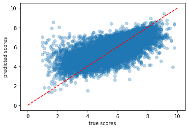
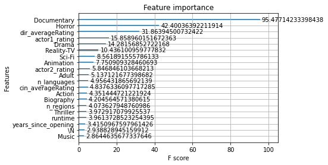
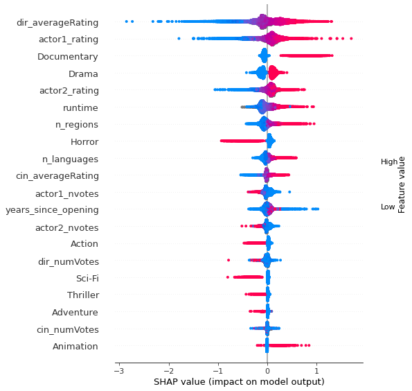

### Summary of Feature Selection and Modeling Process

#### 1. Assumptions and Objective:

The object of this project is to create a model that is capable of predicting the IMDB rating of a movie, 
given the [data](https://datasets.imdbws.com/) available at IMDB. This prompt is quite broad
so I have made two specific assumptions prior to creating the model to constrain the project. The assumptions are listed below:

1. We are going to predict the average rating of *any* movie at this point in time. The movie
could have premiered at *any* time in history, and the principal cast and crew may or may not have made 
other movies before or after the movie in question. We would have all the information for the principal cast and crew
before and after the movie to be predicted. An example of this would be trying to predict the rating of
M. Night Shyamalan's movie Split knowing how all his other movies have performed. Given that IMDB ratings could
be submitted at any time after the movie's premier, this seems like a reasonable assumption.

2. We need a substantial number of votes for the average rating to be *reliable*. When a movie only has tens of ratings, 
the average can be skewed by a few outliers. This would add more noise to our already noisy dataset. I therefore only accepted
movies with more than 100 votes into the final dataset used for model training and evaluation.

#### 2. Feature Selection:
Using the IMDB data provided, I was able to create two sets of features:
- title-based features
- personnel-based features

##### Title-based features 
These features that are generated using information that's specific to the movie. These include:
- runtime
- years since premier
- decade of premier
- number of regions in which the movie was distributed (based on unique AKAs titles)
- number of languages in which the movie was distributed (also based on AKAS titles)
- top 3 genres defined by IMDB

##### Personnel-based features
These features are slightly more complicated. They are numerical features engineered to represent
the reputation of the principal cast and crew of the movie. Based on assumption 1 above, I assumed that
we are allowed to consider all the other works done by the top billing director and top 2 billing actors
as available information that could be used to generate the following features:
- average rating of all other movies done by the top billing director
- average number of votes for all other movies done by the top billing director
- average rating of all other movies done by the top 1 billing actor/actress where they are 
also the top 1 or 2 billing actor/actress
- average rating of all other movies done by the top 2 billing actor/actress where they are 
also the top 1 or 2 billing actor/actress
- average number of votes for all other movies done by the top billing actor/actress where they are 
also the top 1 or 2 billing actor/actress
- average number of votes for all other movies done by the top 2 billing actor/actress where they are 
also the top 1 or 2 billing actor/actress
- average rating of all other movies done by the top-billing cinematographer
- average number of votes for all other movies done by the top-billing cinematographer

#### 3. Model Selection and Hyperparameter Tuning:
There are substantial amount of missing data in several of the engineered features. Due to the time
constraint, I selected XGBoost regression model as my model of choice since XGBoost can automatically handle
missing data, and have known to perform well.

For hyperparameter tuning, I used grid-searched several main hyperparameters of the XGBoost regressor base model:
- max_depth
- n_estimators
- learning_rate
- colsample_bylevel

To train the model, I split the data randomly into 80% training set and 20% testing set.
The grid-search was done using the training data only with 5-fold cross-validation.
The final model is then trained again with the full training data set using the *best* parameters determined by
the grid-search step.
Model performance is evaluated using the 20% testing set.

#### 4. Model Performance and Interpretation:
The best model we generated had a R2 of 0.53, and mean-squared-error of 0.73.

Plotting predicted vs true average ratings of the test set showed that our prediction is certainly 
correlated with the true average rating, but the predicted score tend to cluster more in the middle (between 4-8)
than the true scores.

There are several ways to interpret the model. Since we are using a tree-based model, we usually can only generate 
feature importance, i.e. how much each feature contributed to the final predictions. We generally cannot say which 
feature had a positive or negative impact on the final predict (as we would if we used a linear regression model). 
Below is the top 20 most important features for our final model:

Looks like center genres ("Documentary" and "Horror") and the director's and actor's other movie ratings are the most
influential features.

I also plotted the Shapley values of the features using SHAP summary plots. The SHAP values can show 
how much each feature contributes, either positively or negatively, to the target variable. 
This is like the feature importance plot above but it is able to show the positive or negative 
relationship for each variable with the target.

This plot is made of all the data from the test dataset. 
It demonstrates the following information:
- Feature importance: Variables are ranked in descending order.
- Impact: The horizontal location shows whether the effect of that feature is associated with a 
higher(right) or lower(left) prediction.
- Original value: Color shows whether that feature is high (in red) or low (in blue) for that observation.
- Correlation: if high original values (red) of a feature is associated with higher predicted value (located further
right on the plot) and lower original values (blue) associated with lower predicted value, then that feature 
is likely positively correlated with the target variable.

Looking at the SHAP plot, there are several interesting things we can observe:
1. director's and actor's average ratings are highly correlated with the predicted rating. This seems intuitive 
since the top-billed cast and crew tend to have certain reputations that can influence people's opinion of the films
they are in.
2. Belonging to the genre "Documentary" tend to positive effects on the average rating
3. Belonging to the genres "Horror", "Sci-fi", or "Thriller" tend to have negative effects on the average rating

#### 4. Future Work
As mentioned previous, this is a POC model build under time constraint. 
If given more time and resources, I think the model could be much improved by
add other data sources outside of the IMDB ones. Information such as budget of the movie,
release date, previous festival releases and award nominated/won. We can also obtain richer information about the cast
and crew involved in the movie, as well as bringing in ratings from other sources, which would likely
be highly correlated with the IMDB ratings. 
Having these additional features would certainly improve the model performance.